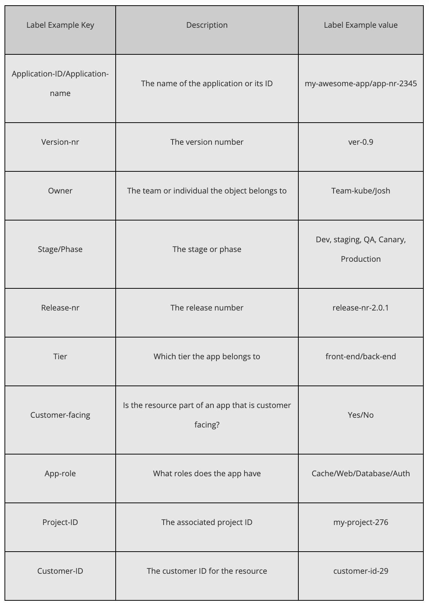

## Label use cases:

- Application name (app: nginx, haproxy)
- Environment name (environment: dev, env: test, qa, prod)
- Release types (release: beta, stable, 0.1.0)
- Deployment metadata (deploy: canary, blue, green)
- Owner/person responsible (owner: bob, team: rocket)
- Interaction types (status: serving, unhealthy, investigating, manual, debugging)
- Abstract part of the architecture or tiers (tier: frontend, component: backend, cache, worker-web)
- Application-specific metadata (partition: client-x, zone: eu, role: master, slave, shard: A)
- Release tracks (track: daily, weekly)
- Helm chart specific (chart: prometheus–1.0, heritage: Tiller)

